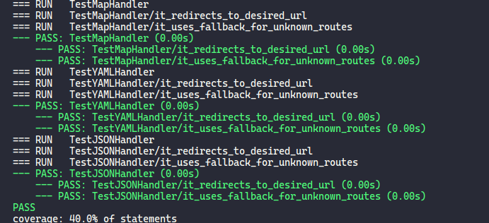

### An http.Handler that forwards paths to other URLs (similar to Bitly)

#### Steps to run:

- Clone the repo
- Do `go run main.go handler.go` and it should start a server at `localhost:8000`
- type URLs like `localhost:8000/urlshort` or`localhost:8000/yaml-godoc` to see it's working

##### For testing:

- Do `go test -v` or `go test -v -cover` for knowing coverage of statements for testing
- For getting test result like mine :grin: :

  

- install `go get -u github.com/rakyll/gotest`
- run `gotest -v -cover`

##### You can also know the portions of code covered by viewing in a html page & for that:

- run `gotest -v -coverprofile=coverage.txt`
- then run `go tool cover -html=coverage.txt -o coverage.html`
- open _coverage.html_ in broswer and <b>done!! :muscle:<b>
